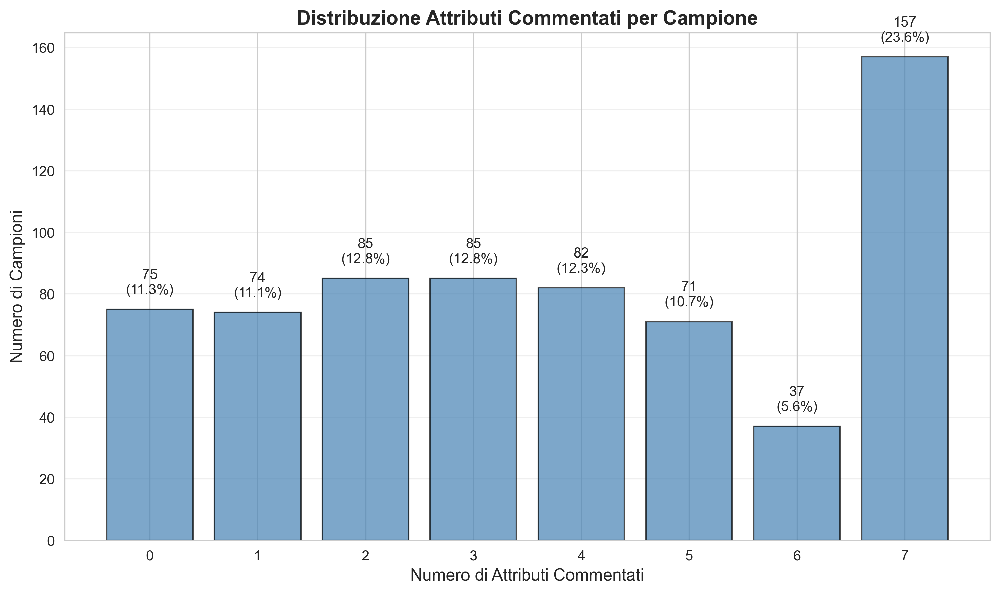
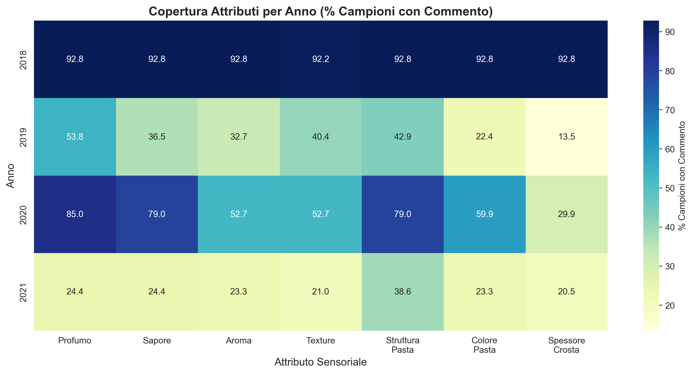
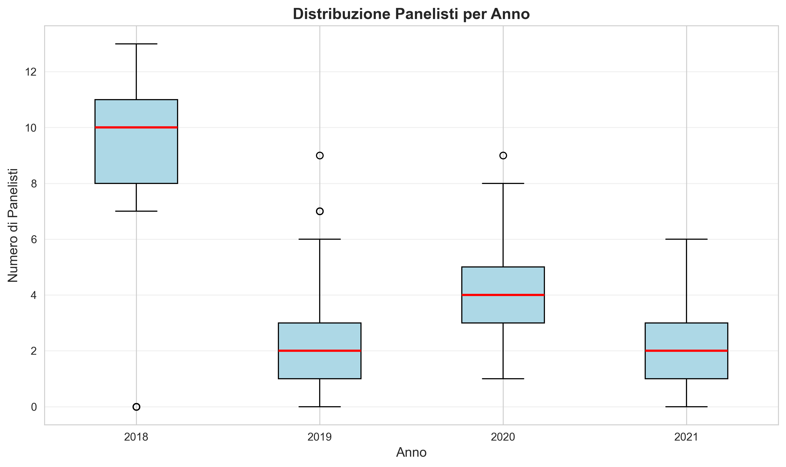

# REPORT ANALISI CAMPIONI - Grana Trentino

**Data elaborazione:** 2026-02-14 16:58:44

---

## 1. DISTRIBUZIONE ATTRIBUTI COMMENTATI PER CAMPIONE

### Totale

|   n_attributi |   n_campioni |   percentuale |   percentuale_cumulativa |
|--------------:|-------------:|--------------:|-------------------------:|
|             0 |           75 |      11.2613  |                  11.2613 |
|             1 |           74 |      11.1111  |                  22.3724 |
|             2 |           85 |      12.7628  |                  35.1351 |
|             3 |           85 |      12.7628  |                  47.8979 |
|             4 |           82 |      12.3123  |                  60.2102 |
|             5 |           71 |      10.6607  |                  70.8709 |
|             6 |           37 |       5.55556 |                  76.4264 |
|             7 |          157 |      23.5736  |                 100      |

### Anno 2018

|   n_attributi |   n_campioni |   percentuale |   percentuale_cumulativa |
|--------------:|-------------:|--------------:|-------------------------:|
|             0 |            6 |      3.59281  |                  3.59281 |
|             1 |            6 |      3.59281  |                  7.18563 |
|             2 |            0 |      0        |                  7.18563 |
|             3 |            0 |      0        |                  7.18563 |
|             4 |            0 |      0        |                  7.18563 |
|             5 |            1 |      0.598802 |                  7.78443 |
|             6 |            5 |      2.99401  |                 10.7784  |
|             7 |          149 |     89.2216   |                100       |

### Anno 2019

|   n_attributi |   n_campioni |   percentuale |   percentuale_cumulativa |
|--------------:|-------------:|--------------:|-------------------------:|
|             0 |           27 |     17.3077   |                  17.3077 |
|             1 |           21 |     13.4615   |                  30.7692 |
|             2 |           38 |     24.359    |                  55.1282 |
|             3 |           29 |     18.5897   |                  73.7179 |
|             4 |           19 |     12.1795   |                  85.8974 |
|             5 |           15 |      9.61538  |                  95.5128 |
|             6 |            6 |      3.84615  |                  99.359  |
|             7 |            1 |      0.641026 |                 100      |

### Anno 2020

|   n_attributi |   n_campioni |   percentuale |   percentuale_cumulativa |
|--------------:|-------------:|--------------:|-------------------------:|
|             0 |            0 |       0       |                  0       |
|             1 |            6 |       3.59281 |                  3.59281 |
|             2 |            6 |       3.59281 |                  7.18563 |
|             3 |           26 |      15.5689  |                 22.7545  |
|             4 |           48 |      28.7425  |                 51.497   |
|             5 |           49 |      29.3413  |                 80.8383  |
|             6 |           25 |      14.9701  |                 95.8084  |
|             7 |            7 |       4.19162 |                100       |

### Anno 2021

|   n_attributi |   n_campioni |   percentuale |   percentuale_cumulativa |
|--------------:|-------------:|--------------:|-------------------------:|
|             0 |           42 |     23.8636   |                  23.8636 |
|             1 |           41 |     23.2955   |                  47.1591 |
|             2 |           41 |     23.2955   |                  70.4545 |
|             3 |           30 |     17.0455   |                  87.5    |
|             4 |           15 |      8.52273  |                  96.0227 |
|             5 |            6 |      3.40909  |                  99.4318 |
|             6 |            1 |      0.568182 |                 100      |
|             7 |            0 |      0        |                 100      |

## 2. DISTRIBUZIONE PANELISTI PER CAMPIONE

| n_panelisti   |   n_campioni |   percentuale |
|:--------------|-------------:|--------------:|
| 0             |           75 |       11.2613 |
| 1             |           70 |       10.5105 |
| 2-3           |          196 |       29.4294 |
| 4-6           |          143 |       21.4715 |
| 7-9           |           69 |       10.3604 |
| 10+           |          113 |       16.967  |

## 3. ATTRIBUTI MANCANTI

### Totale

| attributo             |   n_campioni_senza_commento |   percentuale |
|:----------------------|----------------------------:|--------------:|
| Spessore della Crosta |                         404 |       60.6607 |
| Colore della Pasta    |                         335 |       50.3003 |
| Aroma                 |                         331 |       49.6997 |
| Texture               |                         324 |       48.6486 |
| Sapore                |                         279 |       41.8919 |
| Struttura della Pasta |                         244 |       36.6366 |
| Profumo               |                         242 |       36.3363 |

### Anno 2018

| attributo             |   n_campioni_senza_commento |   percentuale |
|:----------------------|----------------------------:|--------------:|
| Texture               |                          13 |       7.78443 |
| Sapore                |                          12 |       7.18563 |
| Profumo               |                          12 |       7.18563 |
| Aroma                 |                          12 |       7.18563 |
| Struttura della Pasta |                          12 |       7.18563 |
| Colore della Pasta    |                          12 |       7.18563 |
| Spessore della Crosta |                          12 |       7.18563 |

### Anno 2019

| attributo             |   n_campioni_senza_commento |   percentuale |
|:----------------------|----------------------------:|--------------:|
| Spessore della Crosta |                         135 |       86.5385 |
| Colore della Pasta    |                         121 |       77.5641 |
| Aroma                 |                         105 |       67.3077 |
| Sapore                |                          99 |       63.4615 |
| Texture               |                          93 |       59.6154 |
| Struttura della Pasta |                          89 |       57.0513 |
| Profumo               |                          72 |       46.1538 |

### Anno 2020

| attributo             |   n_campioni_senza_commento |   percentuale |
|:----------------------|----------------------------:|--------------:|
| Spessore della Crosta |                         117 |       70.0599 |
| Texture               |                          79 |       47.3054 |
| Aroma                 |                          79 |       47.3054 |
| Colore della Pasta    |                          67 |       40.1198 |
| Sapore                |                          35 |       20.9581 |
| Struttura della Pasta |                          35 |       20.9581 |
| Profumo               |                          25 |       14.9701 |

### Anno 2021

| attributo             |   n_campioni_senza_commento |   percentuale |
|:----------------------|----------------------------:|--------------:|
| Spessore della Crosta |                         140 |       79.5455 |
| Texture               |                         139 |       78.9773 |
| Aroma                 |                         135 |       76.7045 |
| Colore della Pasta    |                         135 |       76.7045 |
| Profumo               |                         133 |       75.5682 |
| Sapore                |                         133 |       75.5682 |
| Struttura della Pasta |                         108 |       61.3636 |

## 4. CAMPIONI CON IMMAGINI MA SENZA COMMENTI

| anno   |   n_inutilizzabili |   n_totali_anno |   percentuale |
|:-------|-------------------:|----------------:|--------------:|
| 2018   |                  6 |             167 |       3.59281 |
| 2019   |                 27 |             156 |      17.3077  |
| 2020   |                  0 |             167 |       0       |
| 2021   |                 42 |             176 |      23.8636  |
| Totale |                 75 |             666 |      11.2613  |

## 5. DISPONIBILITÀ PUNTEGGI

|   anno |   con_punteggi |   senza_punteggi |   totale |
|-------:|---------------:|-----------------:|---------:|
|   2018 |            161 |                6 |      167 |
|   2019 |              0 |              156 |      156 |
|   2020 |              0 |              167 |      167 |
|   2021 |              0 |              176 |      176 |

## 6. SIMULAZIONE SOGLIE

### Totale

| soglia_min_attributi   |   campioni_utilizzabili |   percentuale_totale |
|:-----------------------|------------------------:|---------------------:|
| >= 3                   |                     432 |              64.8649 |
| >= 4                   |                     347 |              52.1021 |
| >= 5                   |                     265 |              39.7898 |
| >= 6                   |                     194 |              29.1291 |
| = 7                    |                     157 |              23.5736 |

### Anno 2018

| soglia_min_attributi   |   campioni_utilizzabili |   percentuale_anno |
|:-----------------------|------------------------:|-------------------:|
| >= 3                   |                     155 |            92.8144 |
| >= 4                   |                     155 |            92.8144 |
| >= 5                   |                     155 |            92.8144 |
| >= 6                   |                     154 |            92.2156 |
| = 7                    |                     149 |            89.2216 |

### Anno 2019

| soglia_min_attributi   |   campioni_utilizzabili |   percentuale_anno |
|:-----------------------|------------------------:|-------------------:|
| >= 3                   |                      70 |          44.8718   |
| >= 4                   |                      41 |          26.2821   |
| >= 5                   |                      22 |          14.1026   |
| >= 6                   |                       7 |           4.48718  |
| = 7                    |                       1 |           0.641026 |

### Anno 2020

| soglia_min_attributi   |   campioni_utilizzabili |   percentuale_anno |
|:-----------------------|------------------------:|-------------------:|
| >= 3                   |                     155 |           92.8144  |
| >= 4                   |                     129 |           77.2455  |
| >= 5                   |                      81 |           48.503   |
| >= 6                   |                      32 |           19.1617  |
| = 7                    |                       7 |            4.19162 |

### Anno 2021

| soglia_min_attributi   |   campioni_utilizzabili |   percentuale_anno |
|:-----------------------|------------------------:|-------------------:|
| >= 3                   |                      52 |          29.5455   |
| >= 4                   |                      22 |          12.5      |
| >= 5                   |                       7 |           3.97727  |
| >= 6                   |                       1 |           0.568182 |
| = 7                    |                       0 |           0        |

## 7. QUALITÀ COMMENTI

| anno   |   con_commenti |   con_commenti_non_generici |   percentuale_non_generici |
|:-------|---------------:|----------------------------:|---------------------------:|
| 2018   |            161 |                         161 |                        100 |
| 2019   |            129 |                         129 |                        100 |
| 2020   |            167 |                         167 |                        100 |
| 2021   |            134 |                         134 |                        100 |
| Totale |            591 |                         591 |                        100 |

## 8. GRAFICI

---

**Note:**
- Un attributo è 'commentato' se ha almeno 1 commento valido (non vuoto, non [REVIEW:...])
- Commenti generici: 'nella norma', 'regolare', 'ok', 'buono', 'buona'
