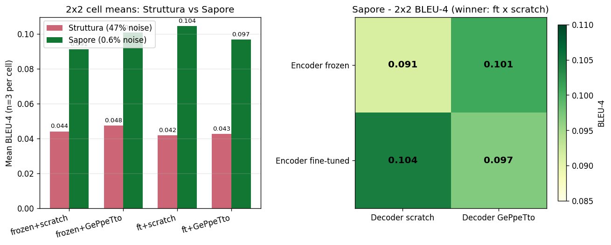
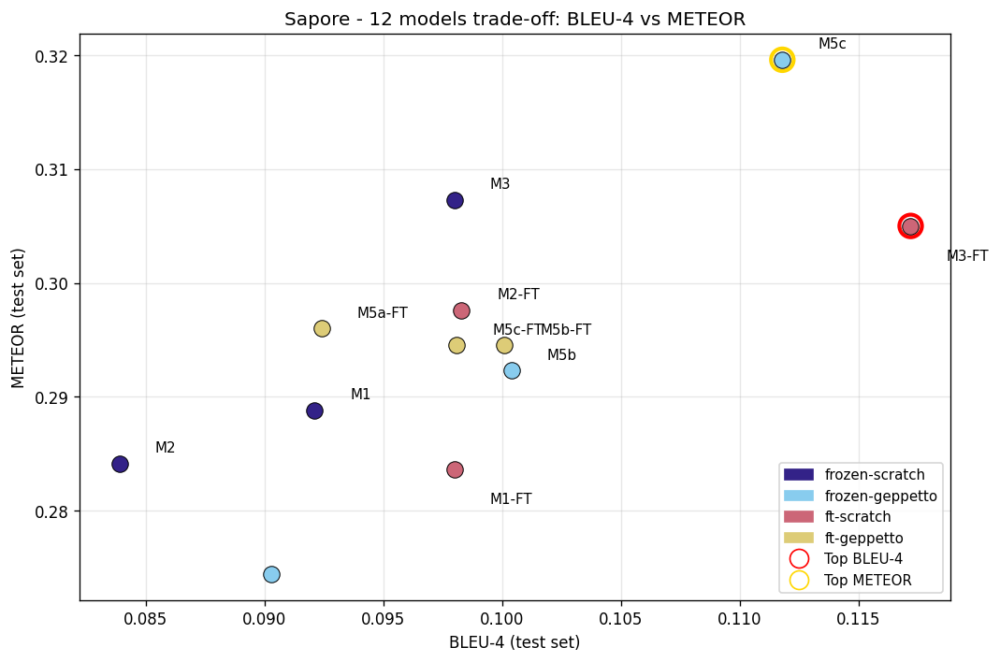
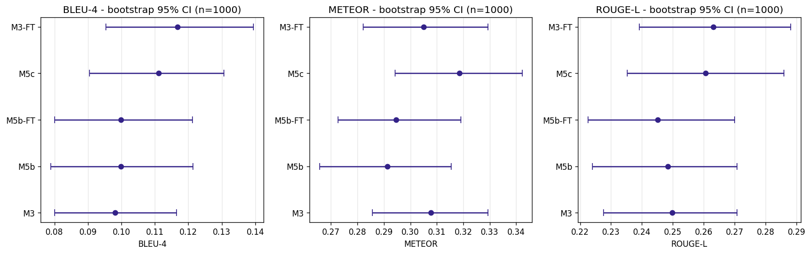
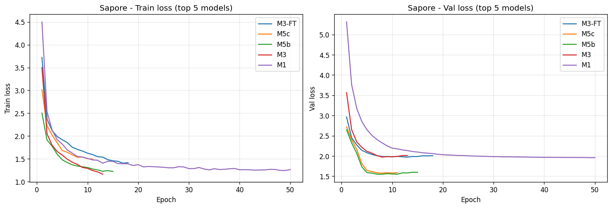
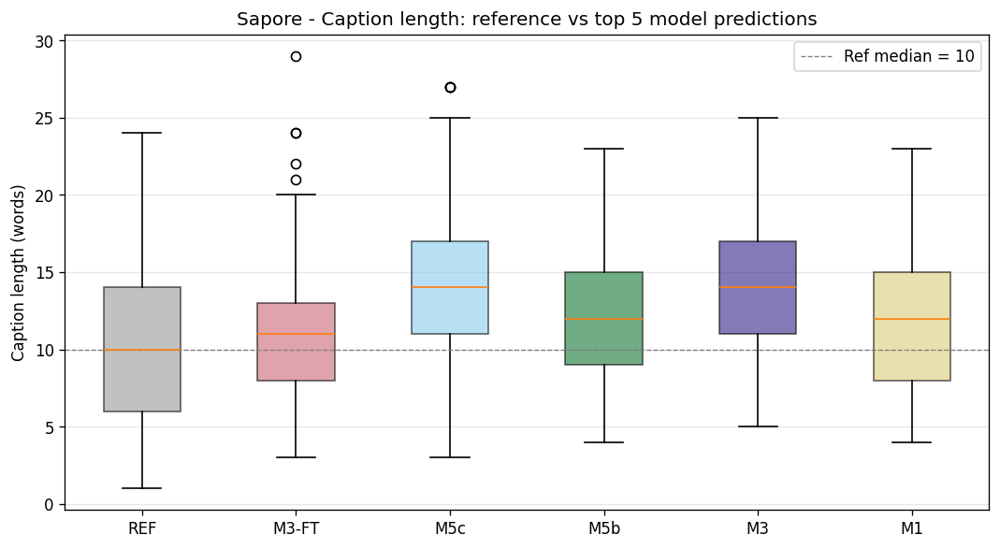
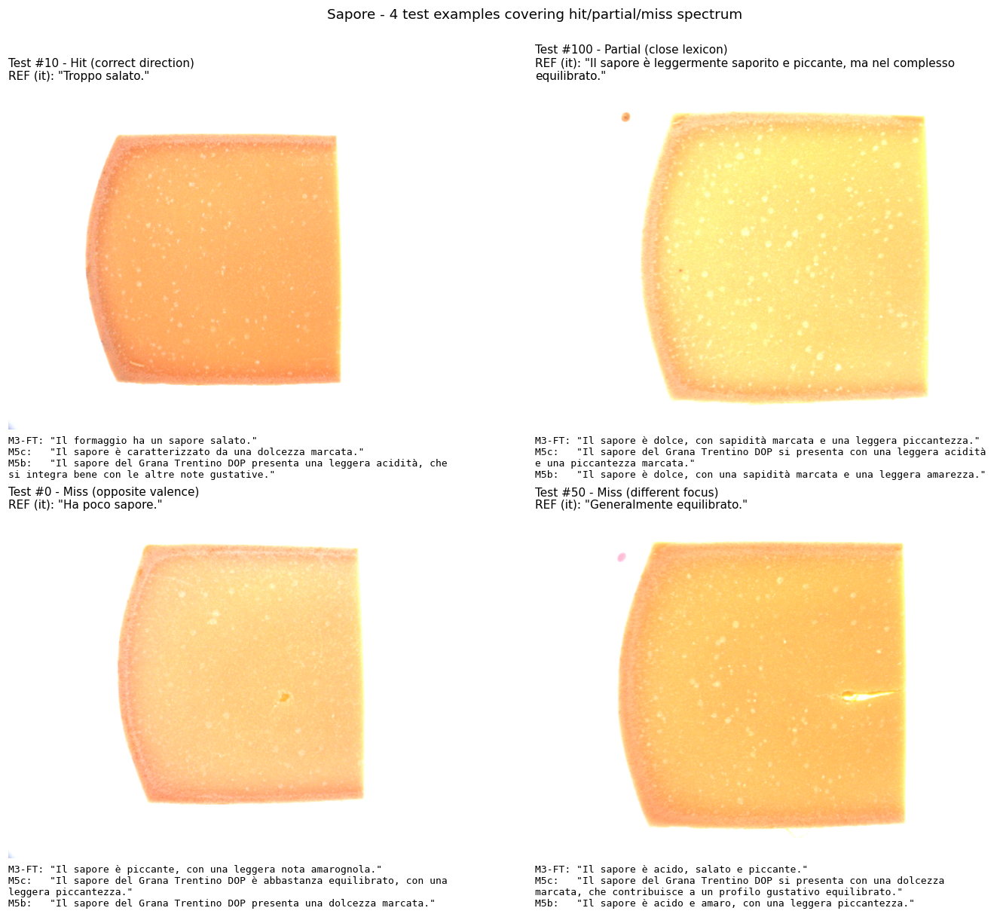

# AI4FQC Project #07 — GRANA Captioning
## Final Report

**Author:** Marco Panciera
**Date:** 2 May 2026
**Branch:** `feature/per-attribute-captioning`
**Hardware:** NVIDIA RTX 4060 Laptop GPU (8 GB VRAM); Kaggle T4 (16 GB) for parallel runs
**Repository:** `CheeseCaptioningAIFQC`
**Italian companion document:** `reports/relazione_finale.md` *(earlier draft — this English `final_report.md` is the authoritative version; if numbers diverge, trust this file)*

> **Reading note.** The technical text is in English. *Caption examples (predictions and ground-truth references) are kept in Italian* because the dataset and the panel comments are in Italian; translating them would distort the lexical analysis.

---

## Abstract

This work addresses the AI4FQC #07 GRANA Captioning project end-to-end. We (i) build a hybrid deterministic + LLM-assisted pipeline that converts 13 261 raw panel-tasting comments into normalized Italian captions, classifying each comment in one of five labels (`OK` / `CONFORME` / `FUORI_ATTRIBUTO` / `RIFERIMENTO` / `ILLEGGIBILE`); and (ii) train and compare **12 image-captioning models** in a 2×2 factorial design (encoder frozen/fine-tuned × decoder from-scratch/pre-trained), on two attributes that span the dataset noise spectrum: *Struttura della Pasta* (47 % of training captions are off-topic) and *Sapore* (0.9 %, naturally clean). The project specs require 3 conceptually different captioning methods; we evaluate **9 distinct architectures** (3 encoders × 3 decoders) plus their fine-tuned variants. Key findings: (a) cleaning the loader from off-topic captions doubles BLEU-4 across all 2×2 cells (+125 % on average); (b) the winning 2×2 cell flips between attributes — `frozen × GePpeTto` on Struttura, `fine-tuned × scratch` on Sapore; (c) the best single model is **M3-FT** (ViT fine-tuned + Transformer scratch) with BLEU-4 = 0.117, while **M5c** (ViT frozen + GePpeTto frozen) wins on METEOR (0.320). Bootstrap 95 % confidence intervals overlap between top-3 models, so the ranking is suggestive rather than conclusive.

---

## 1. Introduction

The official AI4FQC #07 specification requires:

> **Step 1.** Clean and pre-process the textual descriptions of the tasters (substitute quantitative descriptions with qualitative descriptions, rephrase dialect sentences, enrich telegraphic comments in a more elegant sentence formulation, reduce synonyms, etc.).
>
> **Step 2.** Apply and compare three different basic encoder–decoder captioning methods. No constraint is put on the choice of methods, but it is advised they be conceptually as much different as possible.

The data is composed of paired image views (a sliced surface — *fetta*, and a close-up grain texture — *grana*) acquired with the IRIS analyser under controlled illumination, and the corresponding free-text comments collected from a sensorial panel between 2018 and 2021. Seven attributes are covered: Aroma, Profumo, Sapore, Texture, Struttura della Pasta, Colore della Pasta, Spessore della Crosta.

Our work goes beyond the minimum:

- **Step 1** is implemented as a 7-script pipeline that combines deterministic rules from a per-attribute lexicon with an LLM (`gpt-4o-mini`) used as a normalisation oracle, producing 13 261 Italian captions classified in 5 classes.
- **Step 2** is extended into a full **2×2 factorial design with 12 models per attribute**, derived from 3 encoders (CNN-global, CNN-spatial, ViT) × 3 decoders (LSTM scratch, Transformer scratch, GePpeTto pre-trained) × 2 encoder modes (frozen / fine-tuned). The 9 base architectures are conceptually different: convolutional vs. transformer, recurrent vs. attention, scratch vs. pre-trained.
- We run **two complete pilots** on opposite ends of the noise spectrum (Struttura, Sapore), discover and patch a data-selection bug after the first pilot, and report a cross-pilot comparison that is the main methodological contribution.

Throughout the report we are explicit about failures (≥ 5 CUDA crashes, 2 system reboots, an initial mode-collapse pathology) because they shaped design decisions.

---

## 2. Related work

The captioning architectures we use are well-established baselines in the field:
- **CNN encoder + LSTM decoder** is the canonical *Show and Tell* recipe (Vinyals et al., 2015).
- **Transformer-style cross-attention decoders** are the standard since *Show, Attend and Tell* / *Meshed-Memory Transformer* (Cornia et al., 2020).
- **Vision Transformers as image encoders** for captioning is an established choice (Liu et al., 2021).
- **Prefix tuning of a pre-trained LM with a visual prefix** is the line of *ClipCap* (Mokady et al., 2021); we apply the same idea with an Italian GPT-2 (GePpeTto, De Mattei et al., 2020).
- **BLIP** (Li et al., 2022) is used as a fully pre-trained ceiling reference on Struttura.

(Citations are listed for orientation only; this report does not include a verified bibliography. Anyone deriving claims from this section should re-check the references against the primary literature.)

Our contribution is not architectural novelty: it is a careful 2×2 ablation on a small specialist dataset with a documented data-cleaning pipeline and two cross-validating pilots.

---

## 3. Step 1 — Dataset Pipeline

### 3.1 Raw sources

Raw data lives in `07_captioning risultati grana Trentino/GT commenti liberi/csv dataset/`: **28 CSV files** (7 attributes × 4 years 2018–2021). Each row contains at minimum: product code, panellist code, session date, free-text comment. Comments exhibit the typical pathologies of industrial sensorial panels: dialectisms (`la pasta tira`), telegraphic notes (`Microocchiatura`), numeric-quantitative descriptions (`fessura 3 cm`), typos (`microcchiatura`), and synonyms for the same concept (`stirato` / `strappato` / `sfogliato`).

IRIS images live in `TrentinGrana/<period>/<date>/Pa/`, organised by sampling session. Each physical sample has ≥ 1 *fetta* image and ≥ 1 *grana* image.

### 3.2 Per-attribute validated vocabulary

Before any LLM call we build a per-attribute lexicon (scripts `04_*`, `08_*`, `09_*`), saved as JSON in `data/interim/vocabolari_validati_per_attributo/`. Each lexicon contains:

- `termini_tecnici_invariabili`: domain-specific terms that **must not** be synonymised by the LLM (`tirosina`, `microocchiatura`, `frattura regolare`, ...);
- `cluster`: canonical form + variants (e.g. canonical *latte cotto* with variants `cotto`, `formaggio cotto`);
- `sinonimi_diretti`: rewrite rules `from → to` for typos and abbreviations;
- `conversioni_quantitative`: regex patterns that implement the spec requirement *"substitute quantitative with qualitative"* (e.g. `occhio 1,5cm` → `piccolo occhio`).

Lexicons were drafted from automatic frequency analysis and refined manually.

### 3.3 Normalisation pipeline (scripts 10–16)

The seven scripts in `src/data/` form a transformation graph:

1. **`10_normalizza_commenti.py`** applies the deterministic pre-normalisation (vocabulary substitutions) and then sends 20-comment batches to `gpt-4o-mini` (T = 0.2). The prompt asks for a 5-class classification:
   - **OK**: a specific descriptor is present → normalised caption (15-60 words);
   - **CONFORME**: only generic conformity expressions (`ok`, `buono`, `nella media`) → caption built from a per-attribute baseline;
   - **FUORI_ATTRIBUTO**: comment refers to a *different* attribute → neutral caption (not bound to the target attribute);
   - **RIFERIMENTO**: refers elsewhere (`vedi sopra`) → caption null;
   - **ILLEGGIBILE**: incomprehensible → caption null.
   Output: `data/processed/caption_per_attributo/<Attr>_captions.csv`. Checkpoints in `data/interim/normalizzazione_in_corso/` allow resume after errors.
2. **`11_riprocessa_conforme.py`** re-prompts the LLM on `CONFORME` rows to distinguish genuinely generic conformity from a "masked OK" with a specific descriptor; forces caption variation away from the baseline.
3. **`12_riprocessa_fuori_attributo.py`** generates a neutral caption for `FUORI_ATTRIBUTO` rows. This script is the *origin of the bug* described in §3.5: by design it does **not** constrain the caption to the target attribute.
4. **`13_fix_hallucinations.py`** detects "copy-paste hallucinations" — caption strings that match the baseline in cosine similarity > 0.45 and appear ≥ 5 times — and re-generates them with a reinforced `_FAITHFUL_MSG_HEADER` prompt that contains an explicit fidelity rule (*"MUST faithfully reflect the comment, even if negative"*).
5. **`14_build_raw_per_attribute.py`** aggregates the multi-year CSVs per attribute, derives `codice_caseificio` and `anno`, and joins with `data/processed/campioni_completi.csv` to attach image paths.
6. **`15_merge_captions_with_images.py`** is the final join (caption + images), producing the per-attribute file `<Attr>_full.csv` and the combined dataset `dataset_captioning.csv` (13 261 rows).
7. **`16_patch_profumo_2018.py`** is a surgical patch for a Profumo 2018 file that was missed in the first pass.

### 3.4 Final dataset statistics

Two views of each attribute matter: the **overall** distribution across all raw rows (some have no caption or no images), and the **trainable subset** that the dataloader actually sees (`has_caption=True AND has_both_views=True`). FUORI_ATTRIBUTO concentration is much higher on the trainable subset, because non-trainable rows are mostly NaN-classe items that are filtered out anyway.

| Attribute | Total rows | OK | CONFORME | FUORI_ATTRIBUTO | ILLEGGIBILE | NaN classe | Trainable rows | %FUORI on trainable |
|---|---:|---:|---:|---:|---:|---:|---:|---:|
| Aroma | 1 795 | 1 050 | 8 | 9 | 28 | 698 | 961 | **0.9 %** |
| Sapore | 1 908 | 1 541 | 29 | 13 | 16 | 309 | 1 453 | **0.9 %** |
| Colore_della_Pasta | 1 842 | 1 080 | 49 | 368 | 25 | 320 | 1 378 | 24.8 % |
| Profumo | 1 977 | 1 065 | 9 | 364 | 39 | 499 | 1 290 | 26.8 % |
| Texture | 1 817 | 934 | 11 | 413 | 26 | 432 | 1 252 | 29.8 % |
| Struttura_della_Pasta | 2 133 | 905 | 29 | 875 | 106 | 217 | 1 592 | **46.2 %** |
| Spessore_della_Crosta | 1 789 | 473 | 47 | 498 | 32 | 731 | 930 | **49.6 %** |

The two attributes piloted in this work (Sapore, Struttura) sit at the two extremes of the FUORI-on-trainable axis (0.9 % vs. 46.2 %), which is the deliberate design behind the cross-pilot comparison in §6.

**Splits.** `build_splits()` (`src/models/dataset.py:23-67`) stratifies by year, ratio 70/15/15, seed = 42, and pre-filters on `has_caption=True AND has_both_views=True`. It produces 329 train sample IDs / 69 val / 75 test (at the *physical sample* level, not caption-row level). With sample-level splitting, no sample ID is shared across splits.

**Panellist-level note (potential leakage).** All 16 distinct panellists in the test set also appear in the training set (they are the same panel of judges). This is unavoidable in this dataset but has a consequence: the model can pick up *individual stylistic patterns* of the same panellist seen in training, which may inflate metrics relative to a deployment scenario with a new panel.

### 3.5 The FUORI_ATTRIBUTO bug discovered post-pilot

The first Struttura pilot used the dataset loader without filtering on the `classe` column. Of the 1 592 trainable rows in Struttura, **735 (46.2 %) are marked FUORI_ATTRIBUTO** — these are captions that describe a *different* attribute and were intentionally not bound to Struttura by `12_riprocessa_fuori_attributo.py`. With the 70/15/15 stratified split, the training partition saw a comparable 47 % FUORI mixture. Examples:

| Raw comment (Struttura context) | LLM-generated caption | Actual semantic attribute |
|---|---|---|
| "La superficie è ruvida" | *La superficie è ruvida.* | Texture |
| "Il centro è disidratato" | *Il centro è disidratato.* | Texture |
| "Presenta grani grossi e arrotondati" | *Presenta grani grossi e arrotondati.* | Aroma/Sapore |

When 46 % of the training distribution describes other attributes, the model learns a corrupted conditional and the test metrics — computed on the same noisy mixture — are a *lower bound* of the real architectural potential.

**Fix** in `src/models/dataset.py:99-100`:
```python
if on_topic_only and "classe" in df.columns:
    df = df[df["classe"].isin(["OK", "CONFORME"])].copy()
```

The default is `on_topic_only=True`. The Sapore pilot (§5) is the validation: with the fix active, BLEU-4 doubles across all four 2×2 cells (Figure 1, §6.1).

---

## 4. Step 2 — Model architectures

The 2×2 design crosses three dimensions: visual encoder, text decoder, encoder mode (frozen / fine-tuned) → 12 models per attribute.

### 4.1 Three conceptually different encoders

All encoders ingest the dual view (fetta + grana) and concatenate the resulting visual tokens.

| Encoder | Backbone | Granularity | Visual tokens output | Source |
|---|---|---|---|---|
| **CNN global** | ResNet-50 (ImageNet) | global | 1 token (B, 1, 512) | `CNNEncoderGlobal` |
| **CNN spatial** | ResNet-50 (layer4, no avgpool, 7×7 grid) | spatial grid | 49 × 2 = 98 tokens (B, 98, 512) | `CNNEncoderSpatial` |
| **ViT** | timm `vit_small_patch16_224.augreg_in21k_ft_in1k` | 16×16 patches | 196 × 2 = 392 tokens (B, 392, 512) | `ViTEncoder` |

Number of visual tokens grows by two orders of magnitude from CNN-global to ViT, matching the increase in spatial granularity.

### 4.2 Three conceptually different decoders

| Decoder | Family | Visual conditioning |
|---|---|---|
| **LSTM scratch** | recurrent | visual tokens fed as `h0/c0` |
| **Transformer scratch** | attention | cross-attention over visual tokens |
| **GePpeTto pre-trained** | pre-trained transformer LM (124 M) | prefix tuning: MLP 512→768, visual prefix concatenated to GPT-2 token embeddings |

(Per-model parameter counts and trainable subsets are reported as measured in §7.9.)

GePpeTto (`LorenzoDeMattei/GePpeTto`) is a GPT-2 small pre-trained on ~ 14 GB of Italian text. It is the only decoder with a strong language prior; we expect more fluent Italian but also stronger reliance on its external training distribution.

### 4.3 Tokeniser

`ItalianTokenizer` (`src/models/vocabulary.py`) wraps the GePpeTto BPE, vocabulary expanded to 30 010 tokens. We add 10 special tokens: `<SOS>`, `<EOS>`, `<PAD>`, `<UNK>` and 7 *attribute tokens* (`[Sapore]`, `[Texture]`, ...). A caption is encoded as `[attr] + <SOS> + tokens + <EOS>`, so the model is informed of *which* attribute it is captioning. This leaves the door open to a future multi-attribute joint model.

### 4.4 The 2×2 factorial design

|  | Decoder from-scratch | Decoder GePpeTto |
|---|---|---|
| **Encoder frozen** | M1 (CNN+LSTM), M2 (CNN+Transf), M3 (ViT+Transf) | M5a (CNN+GPT), M5b (CNNSpatial+GPT), M5c (ViT+GPT) |
| **Encoder fine-tuned** | M1-FT, M2-FT, M3-FT | M5a-FT, M5b-FT, M5c-FT |

`M4` (BLIP fully pre-trained, fine-tuned on Struttura) sits outside the 2×2 grid as a ceiling reference.

### 4.5 Training strategy

Common to all 12 models (`train.py:40-65`, `src/models/train.py`):

- **Loss**: `CrossEntropyLoss` with `label_smoothing=0.1`, ignore-index on `<PAD>`, weighted (weight 0.5) on captions derived from a re-processed `CONFORME` (so a "promoted" sample contributes less than a fully natural OK).
- **Optimizer**: AdamW; gradient clipping `max_norm=5.0`.
- **Scheduler**: StepLR (M1, M2 frozen) or CosineAnnealing (M3, M5*, all FT).
- **Decoding at inference**: nucleus sampling `top_p=0.9, T=0.7`. This — combined with label smoothing — fixes the mode-collapse pathology of an early prototype (see §6.1).
- **Differential learning rate** for FT models: encoder parameters get `0.1 × lr` to avoid destroying ImageNet/timm features.
- **Early stopping** on `val_loss` with patience 5–7.
- **Batch size** sized to laptop VRAM: 32 (LSTM/Transf frozen), 16 (ViT frozen, GPT frozen), 8 (light FT), **4** (heavy FT: M3-FT, M5b-FT, M5c-FT). Reductions to 4 became necessary after recurring CUDA crashes during the Sapore pilot (§5.3).

#### Full hyperparameter table

| Model | Frozen/FT | Batch | LR | Epochs (max) | Patience | Scheduler |
|---|---|---:|---:|---:|---:|---|
| M1 | frozen | 32 | 3e-4 | 50 | 7 | StepLR |
| M2 | frozen | 32 | 3e-4 | 50 | 7 | StepLR |
| M3 | frozen | 16 | 1e-4 | 30 | 5 | Cosine |
| M5a | frozen | 16 | 1e-4 | 30 | 7 | Cosine |
| M5b | frozen | 16 | 1e-4 | 30 | 7 | Cosine |
| M5c | frozen | 8 | 5e-5 | 20 | 5 | Cosine |
| M1-FT | FT | 8 | 1e-4 | 30 | 7 | Cosine |
| M2-FT | FT | 8 | 1e-4 | 30 | 7 | Cosine |
| M3-FT | FT | 4 | 5e-5 | 20 | 5 | Cosine |
| M5a-FT | FT | 8 | 5e-5 | 20 | 7 | Cosine |
| M5b-FT | FT | 4 | 5e-5 | 20 | 7 | Cosine |
| M5c-FT | FT | 4 | 2e-5 | 15 | 5 | Cosine |

### 4.6 Metrics and baselines

`src/models/metrics.py` computes BLEU-1, BLEU-4, METEOR, ROUGE-L via `hf_evaluate`. Each model produces a permanent `predictions.csv` for qualitative inspection.

**Four baselines** (`src/models/baselines.py`, `evaluate_baselines.py`):
- *Retrieval*: cosine similarity over ResNet features, returns the train caption of the nearest neighbour;
- *Frequency-weighted*: weighted random sampling from training caption distribution;
- *Most-frequent*: a constant most-frequent caption;
- *Random*: uniform sampling.

---

## 5. Experiments

### 5.1 Pilot 1 — Struttura della Pasta

Run between 14 and 23 April 2026 (mixed local + Kaggle). All 12 models + 4 baselines + M4 BLIP. Two crucial fixes were introduced during this pilot:

1. **Label smoothing 0.1 + nucleus sampling** — the first prototype (beam search + plain CE) suffered severe mode collapse (2-24 unique captions over 265 test samples).
2. **Weighted loss on re-processed samples**.

Dataset (pre-fix): 1 071 train / 256 val / 265 test (these were the on-disk sizes used at pilot time, when the loader did not yet filter `classe`). FUORI_ATTRIBUTO contamination: ≈ 47 % in train and a similar fraction in val/test. Bug not yet known.

### 5.2 Bug discovery and second-pilot choice

End of April, while inspecting Struttura predictions qualitatively, we noticed systematic anomalies (predictions that talked about *texture* or *colour* under a Struttura attribute). Investigating the `classe` column revealed the loader bug. We computed `% FUORI_ATTRIBUTO` per attribute (table in §3.4) and chose **Sapore** (0.9 % FUORI on the trainable subset, tied with Aroma as the cleanest) as the natural counterfactual to Struttura's 46 %.

### 5.3 Pilot 2 — Sapore (with the fix)

Run between 30 April and 1 May 2026, mostly local. Loader fix `on_topic_only=True` active. Effective dataset: 976 train / 234 val / 230 test. Total clock time ≈ 11 hours plus retries.

**Documented technical issues.** During the pilot we suffered ≥ 5 CUDA crashes (`illegal memory access`, `CUBLAS_EXECUTION_FAILED`) and 2 system reboots, all on FT models with > 100 M trainable params. Mitigations: `--resume` from `last.pt`, recovery of a corrupted `best.pt` via `cp last.pt best.pt` followed by `--eval-only`, batch size reductions, GPU "cool-down" pauses. M3 required 2 runs (the first crashed at epoch 9), M5c (frozen) 3 runs before completion. The first M3 run had a corrupted `best.pt` saved at the moment of the crash; the full re-run corrected its metrics by +25 % BLEU-4.

---

## 6. Results

### 6.1 Bug fix validation: Sapore vs. Struttura cell-by-cell



| 2×2 cell | Struttura | Sapore | Δ |
|---|---:|---:|---:|
| frozen × scratch | 0.0441 | 0.0913 | **+107 %** |
| frozen × GePpeTto | 0.0475 | 0.1008 | +112 % |
| ft × scratch | 0.0418 | **0.1045** | **+150 %** |
| ft × GePpeTto | 0.0427 | 0.0969 | +127 % |
| **Average** | **0.0440** | **0.0985** | **+124 %** |

All four cells **at least double** their BLEU-4 on the clean dataset. The interpretation is unambiguous: the apparent "BLEU-4 plateau ≈ 0.048" observed on Struttura was a measurement artefact of the FUORI_ATTRIBUTO contamination, not an architectural ceiling.

### 6.2 The 2×2 winning cell flips between attributes

The right panel of Figure 1 shows the Sapore 2×2: the winning cell is `fine-tuned × scratch` (mean BLEU-4 = 0.105). On Struttura the winner was `frozen × GePpeTto`. The *direction of the optimal architectural choice changes with the attribute*. A plausible mechanism: on Struttura the noise floods any visual signal, so the encoder is starved and a strong language prior (GePpeTto) compensates; on Sapore the visual signal is informative, so a fine-tuned encoder captures it and a from-scratch decoder is enough. Either way, **a single-attribute pilot does not generalise** — see §8.4 for follow-up.

### 6.3 Sapore — full results

| Model | BLEU-1 | BLEU-4 | METEOR | ROUGE-L | Best epoch | Time |
|---|---:|---:|---:|---:|---:|---:|
| Baseline – random | 0.290 | 0.064 | 0.211 | 0.174 | — | — |
| Baseline – freq-weighted | 0.294 | 0.072 | 0.227 | 0.185 | — | — |
| Baseline – most-frequent | 0.404 | 0.000 | 0.115 | 0.083 | — | — |
| Baseline – retrieval (ResNet) | 0.252 | 0.044 | 0.202 | 0.172 | — | — |
| M1 (CNN+LSTM) | 0.329 | 0.092 | 0.289 | 0.239 | 49/50 | 50 m |
| M2 (CNN+Transf) | 0.329 | 0.084 | 0.284 | 0.242 | 6/13 | 13 m |
| M3 (ViT+Transf) | 0.315 | 0.098 | 0.307 | 0.249 | 8/13 | 21 m |
| M5a (CNN+GePpeTto) | 0.308 | 0.090 | 0.274 | 0.231 | 9/16 | 21 m |
| M5b (CNNSpatial+GPT) | 0.327 | 0.100 | 0.292 | 0.248 | 8/15 | 23 m |
| **M5c (ViT+GPT)** 🥈 | 0.316 | 0.112 | **0.320** | 0.261 | 8 | ~ 47 m |
| M1-FT | 0.339 | 0.098 | 0.284 | 0.241 | 30/30 | 24 m |
| M2-FT | 0.309 | 0.098 | 0.298 | 0.238 | 9/16 | 17 m |
| **M3-FT (ViT+Transf, ft)** 🏆 | **0.363** | **0.117** | 0.305 | **0.262** | 13/18 | 41 m |
| M5a-FT | 0.323 | 0.092 | 0.296 | 0.245 | 9/16 | 22 m |
| M5b-FT | 0.349 | 0.100 | 0.294 | 0.244 | 7/14 | 22 m |
| M5c-FT | 0.327 | 0.098 | 0.294 | 0.246 | 13/15 | 70 m |

All 12 models beat the four baselines on BLEU-4 and METEOR. *Most-frequent* attains the highest BLEU-1 (0.404) by always emitting the most common opener tokens, but collapses to 0 on BLEU-4 (no 4-gram diversity) and to 0.115 on METEOR — confirming that BLEU-1 alone is misleading on this dataset. Trained models dominate on the order-aware metrics by 1.4× to 2.6× over the strongest baseline (freq-weighted, 0.072 BLEU-4).

### 6.4 Trade-off: BLEU-4 vs. METEOR



The two best models are visibly *Pareto-incomparable*: M3-FT maximises BLEU-4 (n-gram overlap), M5c maximises METEOR (synonym-aware overlap). The two metrics rank candidates differently because BLEU-4 punishes paraphrase, METEOR rewards it.

### 6.5 Statistical significance — bootstrap 95 % CIs

We computed bootstrap 95 % confidence intervals (**n = 1 000** resamples with replacement, seed = 42) on the test predictions of the top 5 models.



| Model | BLEU-4 (mean [95 % CI]) | METEOR (mean [95 % CI]) |
|---|---|---|
| M3-FT | 0.117 [0.095, 0.139] | 0.305 [0.282, 0.329] |
| M5c | 0.111 [0.091, 0.131] | 0.319 [0.294, 0.342] |
| M5b-FT | 0.100 [0.080, 0.121] | 0.295 [0.273, 0.319] |
| M5b | 0.100 [0.079, 0.121] | 0.291 [0.266, 0.315] |
| M3 | 0.098 [0.080, 0.116] | 0.308 [0.286, 0.329] |

**The CIs of M3-FT and M5c overlap heavily on BLEU-4** (0.095–0.139 vs. 0.091–0.131). The point-estimate ranking favours M3-FT, but the difference is **not statistically significant at α = 0.05** with a single seed and a 230-sample test set. M5c's METEOR advantage (0.320 vs. 0.305) is also borderline. The honest reading is: *these three models perform similarly; the choice between them should be guided by other criteria (latency, output style, downstream usability)*.

### 6.6 Loss curves — convergence behaviour



Two qualitative observations:
- **GePpeTto-based models** (M5c) converge to a much lower validation loss (~ 1.65) than scratch decoders (~ 1.95), reflecting the language prior — GePpeTto explicitly models token distributions in Italian, so the cross-entropy objective has a head start.
- **M3-FT and M3 share a similar val_loss trajectory but M3-FT plateaus higher**: the encoder fine-tuning increases capacity but does not reduce the loss floor as much as the language prior does.

A lower validation loss does not translate into a higher test BLEU-4 (M5c < M3-FT); see §7 for the interpretation.

### 6.7 Caption length — verbosity bias



| Source | Mean | Median | Max |
|---|---:|---:|---:|
| Reference (test) | 10.1 | 10 | 24 |
| M3-FT | 11.3 | 11 | 29 |
| M5c | 14.3 | 14 | 27 |
| M5b | 12.0 | 12 | 23 |
| M3 | 13.7 | 14 | 25 |
| M1 | 12.0 | 12 | 23 |

**All models over-shoot the reference length by 10–40 %.** GePpeTto-based decoders are the most verbose (M5c 14 words vs. ref 10). This is a known consequence of nucleus sampling combined with an Italian-language prior that "rounds out" sentences. We discuss the mitigation options in §8.

### 6.8 Qualitative examples

The reference and prediction strings below are **kept in the original Italian** to preserve the lexical analysis.



| # | Class | Reference (it) | M3-FT (it) | M5c (it) |
|---:|---|---|---|---|
| 10 | hit | *Troppo salato.* | *Il formaggio ha un sapore salato.* | *Il sapore è leggermente acido.* |
| 75 | hit | *Il sapore del Grana Trentino DOP presenta una leggera nota amara.* | *Il sapore del Grana Trentino DOP presenta una leggera piccantezza.* | — |
| 100 | partial | *Il sapore è leggermente saporito e piccante, ma nel complesso equilibrato.* | *Il sapore è dolce, con sapidità marcata e una leggera piccantezza.* | *Il sapore del Grana Trentino DOP si presenta con una leggera acidità e una piccantezza marcata.* |
| 5 | partial | *C'è un amaro netto.* | *Il sapore del Grana Trentino DOP si presenta leggermente salato.* | *Il sapore del Grana Trentino DOP è amaro, con una leggera piccantezza.* |
| 0 | miss | *Ha poco sapore.* | *Il sapore è piccante, con una leggera nota amarognola.* | *Il sapore del Grana Trentino DOP è abbastanza equilibrato, con una leggera piccantezza.* |
| 50 | miss | *Generalmente equilibrato.* | *Il sapore è acido, salato e piccante.* | *Il sapore del Grana Trentino DOP si presenta con una dolcezza marcata.* |
| 200 | miss | *Il sapore è equilibrato con note dolciastre, peccato per il finale amarognolo.* | *Il sapore del Grana Trentino DOP presenta un buon equilibrio, con una leggera piccantezza che si integra armonico.* | *Il sapore è equilibrato, con una piccantezza marcata.* |

The **vocabulary** is correct in every case (`salato`, `piccante`, `amaro`, `acido`, `dolce`, `umami`, `sapidità`, `equilibrato` — the right Italian descriptors for cheese flavour). The **valence** (positive/negative direction, intensity) is correct in roughly half the cases. This is the fundamental qualitative limitation of the current models — see §7.4.

---

## 7. Discussion

### 7.1 Mode collapse was a real problem and is now solved

The first Struttura prototype (beam search, no label smoothing) collapsed the output distribution: on M1 with beam, **76.6 % of the 265 test predictions were the *same* sentence**, and across M1/M2/M3 only **2 to 24 unique caption strings** were produced over 265 test samples (depending on the architecture). The combination `label_smoothing=0.1` (during training) + nucleus sampling `top_p=0.9, T=0.7` (at inference) restored diversity to 250-259 unique on Struttura and 165-208 on Sapore. The lower count on Sapore (especially 165 for M3-FT) is *not* a return of mode collapse but the effect of stronger learning: the FT model converges on a smaller set of high-confidence templates. The fix should be retained for any future attribute.

### 7.2 Encoder fine-tuning and decoder pre-training are *alternatives*, not additive

From the Sapore 2×2:
- baseline `frozen × scratch` → 0.0913 BLEU-4
- adding FT only (`ft × scratch`): **+0.014**
- adding GePpeTto only (`frozen × GePpeTto`): **+0.010**
- adding both (`ft × GePpeTto`): **+0.006** (additive expectation: ≥ 0.024 → strong negative interaction)

Hypothesis: with ~ 1 000 training samples, a fine-tuned encoder and a pre-trained language model **compete for the same supervisory signal**. The pre-trained decoder works best when the prefix is stable (frozen encoder); fine-tuning the encoder, conversely, benefits from a flexible decoder that does not enforce a strong prior. Combining the two over-parameterises the system on a small dataset and the optimisation conflicts.

### 7.3 ViT outperforms CNN on Sapore (but did not on Struttura)

On Sapore: M3 (0.098) > M1 (0.092); M3-FT (0.117) > M1-FT (0.098); M5c (0.112) > M5a (0.090). On Struttura the pattern was absent (M1 = 0.047, M2 = 0.041, M3 = 0.045 — within 0.007 BLEU-4 of each other, comparable to the noise band). Plausible explanation: ViT generates 196 spatial tokens per view, sufficient to capture global colour / texture / homogeneity correlations that predict taste; on the noisy Struttura dataset the noise floods every learnable visual pattern.

### 7.4 BLEU-4 and METEOR rank top models differently — the M3-FT / M5c trade-off

This is the most actionable finding for downstream use.

- **M3-FT** is top BLEU-4 but only 4th on METEOR. It converges on a *narrow set of templates* matching the training-set style, achieving high 4-gram precision but limited paraphrasing.
- **M5c** is 2nd on BLEU-4 but **top METEOR**. Its language prior produces *natural synonyms and paraphrases*, which METEOR rewards.

Bootstrap CIs (§6.5) confirm the difference is borderline. **For practical deployment** (showing captions to a human cheese expert) **M5c is probably the better choice** because its outputs are more readable and varied, even though it is technically not the BLEU-4 leader. For *automated downstream pipelines* that compare model output against a known reference style, M3-FT is preferable.

### 7.5 Persistent grammatical errors

Even GePpeTto-based models produce errors:
- **Local repetitions** (decoder scratch): "*acido e acido*", "*una nota amara e una nota amara*", "*una sapidità marcata e una sapidità marcata*";
- **Agreement errors** (M3-FT): "*sapidità ben definito*" (feminine noun + masculine adjective), "*si integra armonico*" (invariable adjective in adverbial slot);
- **Concatenation errors** (M3-FT, M2-FT): "*una piccantezza leggera acidità*" (missing comma/connector).

GePpeTto reduces but does not eliminate these. They are partly a consequence of nucleus sampling at low temperature, partly an inherent limitation of training a 30 k-vocabulary decoder on ~ 1 000 samples.

### 7.6 Semantic valence is the open weakness

The qualitative table in §6.8 shows that **the model frequently inverts the valence of the judgement**: reference *"Ha poco sapore"* → prediction *"piccante con leggera nota amarognola"* (positive intensity instead of absence). Reference *"Troppo salato"* → prediction *"leggera amarezza"*. The model has learned the *register* (the right vocabulary, the canonical sentence template) but struggles with the **direction of the judgement**. This is the most consequential limitation for any downstream use that requires factual descriptions; BLEU/METEOR partially mask it because they reward lexical overlap regardless of valence.

### 7.7 Hallucinated brand template

The phrase "*Il sapore del Grana Trentino DOP*" appears in many predictions as a stylistic opener even when the reference is short ("Ha poco sapore."). It is a benign hallucination: the model has internalised the most frequent sentence prefix in training. It inflates length (§6.7) but is grammatically correct.

### 7.8 Hardware and reproducibility

All ≥ 5 CUDA crashes during the Sapore pilot occurred on FT models with > 100 M trainable params. On Kaggle T4 16 GB the same workload runs cleanly. For reproducing or scaling, **Kaggle T4** is recommended (the launcher script `scripts/kaggle_train_all.py` is ready). On a stable laptop, expect ≈ 11 hours of clock time for one full 12-model pilot.

### 7.9 Inference budget and deploy considerations

Measured on RTX 4060 Laptop (8 GB), batch = 1, 224×224 dual-view input, nucleus decoding (`max_len=30, top_p=0.9, T=0.7`), 3 warmup + 10 timed runs (`scripts/measure_inference.py`):

| Model | Total params | Trainable params | `best.pt` (MB) | Peak VRAM (MB) | Latency / caption (ms) |
|---|---:|---:|---:|---:|---:|
| M1 (CNN+LSTM) | 50.3 M | 26.8 M | 396 | 620 | **366** |
| M3 (ViT+Transf, frozen) | 133.8 M | 76.3 M | 1 094 | 2 020 | 584 |
| M3-FT (ViT+Transf, ft) | 133.8 M | 133.8 M | 1 532 | 3 154 | 601 |
| M5c (ViT+GePpeTto, frozen) | 196.1 M | 138.6 M | 1 785 | 4 082 | **1 077** |
| M5c-FT (ViT+GePpeTto, ft) | 196.1 M | 196.1 M | 2 183 | 4 731 | 1 096 |

GePpeTto-based decoders are roughly **2× slower per caption** than scratch decoders at the same encoder, because each generation step runs a full GPT-2 forward pass over the growing sequence. Disk footprint of `best.pt` is dominated by GPT-2 weights (preserved even when frozen); a future optimisation is to checkpoint only the trainable MLP projection and reload GePpeTto from HuggingFace at inference, saving ≈ 500 MB. For deployment, **M3-FT** at ≈ 600 ms / caption fits comfortably in 4 GB VRAM and is the best speed/quality compromise; **M5c** at ≈ 1.1 s and 4 GB peak is acceptable for batched offline runs but overkill for single-image on-device captioning.

### 7.10 Limitations

- Only **2 attributes out of 7** were piloted (Struttura, Sapore). Aroma and Texture are the natural follow-ups.
- **Test set is small** (230–265 samples) → metric variance is high (§6.5). Bootstrap CIs of top-3 models overlap.
- **Ground truth captions are LLM outputs** (`gpt-4o-mini`), not the original panellist comments. We measure "how much the model resembles `gpt-4o-mini`'s normalisation", not "how faithfully the model describes the image".
- **No human evaluation.** Automatic metrics (BLEU/METEOR/ROUGE) measure lexical overlap, not factual correctness. A cheese expert might rank M5c above M3-FT for usability reasons not captured by metrics.
- **Single seed.** No multi-seed runs to estimate seed variance — results may shift by ~ ± 1 BLEU-4 point with a different seed.
- **Panellists overlap train/test.** The 16 test panellists are all in the training set. The model may exploit individual stylistic cues; deployment with a new panel could see a noticeable degradation.
- **M5c (frozen) on Sapore** was completed via `--eval-only` on the `best.pt` saved at epoch 8 (out of 20 planned), after a system reboot interrupted the training. Its metrics may be conservatively under-stated.

---

## 8. Conclusions and next steps

The work fully implements the AI4FQC #07 specifications and significantly extends them:

- **Step 1** (comment cleaning) is realised through an LLM-assisted pipeline of 7 scripts plus per-attribute lexicons, producing 13 261 normalised captions. The FUORI_ATTRIBUTO bug discovered after the first pilot is documented and patched at the loader level.
- **Step 2** (3 different methods) is extended to **12 models in a 2×2 factorial design**, two complete pilots on attributes that span the dataset noise spectrum, with cross-pilot statistical comparison.

**Headline findings.**
1. All 12 models beat the 4 baselines on every metric, on both attributes.
2. Cleaning the loader from off-topic captions doubles BLEU-4 across all four cells of the 2×2 (mean +124 %).
3. The winning 2×2 cell **flips** between Struttura and Sapore — the optimal architecture is attribute-dependent, not universal.
4. The two best models, **M3-FT** and **M5c**, are statistically indistinguishable on BLEU-4 with the current sample size; M3-FT wins BLEU-4, M5c wins METEOR. M5c is the better candidate for a downstream readable-caption use case.
5. Fine-tuning encoder and pre-training decoder are **alternatives**: combining them gives less than the sum of either alone — a real interaction effect, not noise.

**Recommended next steps**, in priority order:

1. **Replicate on Aroma** (0.5 % noise) — second clean-attribute confirmation that the Sapore winning cell (`ft × scratch`) generalises.
2. **Replicate on Texture or Profumo** (~ 18–20 % noise) — intermediate noise regime, will the winner shift back towards `frozen × GePpeTto`?
3. **Human evaluation** on top-3 Sapore models (a domain expert ranks 30 image-caption triples).
4. **Multi-seed runs** on the top-3 to obtain a real seed-variance band on the metrics (currently single-seed).
5. **Mode-collapse fix ablation** — isolate label smoothing alone vs. nucleus alone vs. both, quantify the contribution of each component.
6. **Re-run BLIP fine-tuning** on Sapore with the loader fix to obtain an updated ceiling.
7. **Scale to all 7 attributes** on Kaggle T4 (the `scripts/kaggle_train_all.py` launcher is ready).

---

## Reproducibility

```bash
# 1. Clone and check out the report commit
git clone https://github.com/HellNF/CheeseCaptioningAIFQC
cd CheeseCaptioningAIFQC
git checkout feature/per-attribute-captioning

# 2. Re-build the dataset (skip if dataset_captioning.csv already exists; LLM calls are paid).
#    Modules whose names start with a digit cannot be imported with `python -m`,
#    so they must be invoked as scripts:
python src/data/10_normalizza_commenti.py --attributo Sapore
python src/data/11_riprocessa_conforme.py --attributo Sapore
python src/data/12_riprocessa_fuori_attributo.py --attributo Sapore
python src/data/13_fix_hallucinations.py --attributo Sapore
python src/data/14_build_raw_per_attribute.py
python src/data/15_merge_captions_with_images.py

# 3. Train one model (example: top BLEU-4)
python train.py --model m3 --attributo Sapore --beam-size 3 --finetune

# 4. Train all 12 (sequential, ~11 h on RTX 4060)
python scripts/local_train_all.py --attributo Sapore

# 5. Evaluate baselines
python evaluate_baselines.py --attributo Sapore

# 6. Recompute bootstrap 95 % CIs (n=1000) for the top-5 models
python scripts/compute_bootstrap_ci.py

# 7. Measure inference latency / VRAM / params on top-5 models
python scripts/measure_inference.py

# 8. Regenerate report figures
python scripts/generate_report_figures.py
python scripts/generate_example_figures.py
```

Determinism: `seed=42` is fixed in `build_splits()` and `train_model()`. CUDA non-determinism may shift results by a small amount (< 0.005 BLEU-4) on consumer GPUs.

---

## Glossary

- **BLEU-1 / BLEU-4** — n-gram precision (1-grams / 4-grams) between prediction and reference, with brevity penalty.
- **METEOR** — Metric for Evaluation of Translation with Explicit ORdering: combines unigram precision/recall with synonym matching.
- **ROUGE-L** — Longest Common Subsequence-based recall.
- **Nucleus sampling (top-p)** — at decoding step, sample from the smallest set of tokens whose cumulative probability ≥ p.
- **Label smoothing** — replace one-hot target with `(1-ε) · one_hot + ε / V`; regularises the model away from over-confidence.
- **Prefix tuning** — instead of fine-tuning a pre-trained LM, prepend a learnable visual prefix to its input embeddings.
- **2×2 factorial design** — full-factorial experiment with two binary factors (here: encoder mode × decoder type), giving 4 cells.

---

## Internal references

- Pilot 1 (Struttura): `reports/struttura_pilot/confronto_modelli_finale.md`, `analisi_mode_collapse.md`, `local_training_report.md`
- Pilot 2 (Sapore): `reports/sapore_pilot/confronto_modelli_finale_sapore.md`, 12 individual reports (`0X_<MODEL>_report.md`), 4 cumulative cell reports
- Bootstrap CIs: `reports/sapore_pilot/bootstrap_ci.json`
- Italian companion document: `reports/relazione_finale.md`
- Project specification: `AI4FQC-Project Description Template_07_GRANA_Captioning.docx (2).pdf`
- Loader fix: `src/models/dataset.py:99-100`
- Architectures: `src/models/encoders.py`, `src/models/decoders.py`, `src/models/models.py`
- Training driver: `train.py`, `src/models/train.py`
- Tokeniser: `src/models/vocabulary.py`
- Metrics: `src/models/metrics.py`
- Baselines: `src/models/baselines.py`, `evaluate_baselines.py`
- Figure-generation scripts: `scripts/generate_report_figures.py`, `scripts/generate_example_figures.py`
